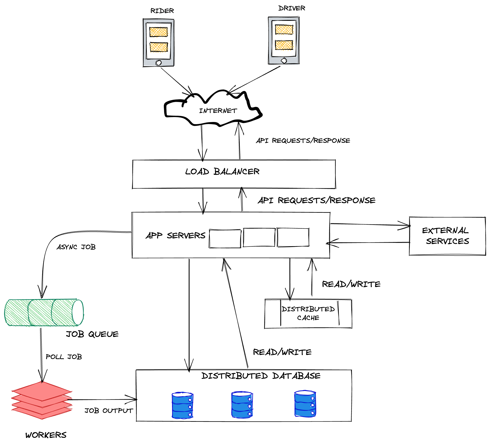

## System Design for Uber/Lyft

### Features
Establish 2-3 core features for MVP
- Display rider and driver profile
- User can hail a ride and driver can give a ride.

### Use Cases
A ride-hailing app is very state-based.

#### Rider
1. Request Ride
2. wait for driver to pick up
3. Ride to destination
4. Ride ends

#### Driver
1. Accept/Reject Request
2. Pickup Rider
3. Drive to Destination
4. End Ride

### What to store

### Rider
1. Personal Info (Name, Email, Phone no)
2. Location
3. State (INACTIVE, REQUESTING_RIDE, WAITING_FOR_PICKUP, RIDING_TO_DESTINATION)

### DRIVER
1. Personal Info (Name, Email, Phone no)
2. Location
3. State (INACTIVE, WAITING_TO_ACCEPT DRIVING_TO_SOURCE, DRIVING_TO_DESTINATION)

## High Level Design

1. Distributed DB - metadata such as ID, contact details, profile picture
2. cache stores - driver/rider state, current driver location, ETA times etc
3. Job queue and workers - Handle async tasks such as payments, tipping etc. Such processes are not completed immediately due to interactions with 3rd party entities (banks) but the UI can be updated.
4. External services can be driver-matching service, geo-location service, notification service.
5. Talk about how state transition happens
6. State transitions trigger notifications