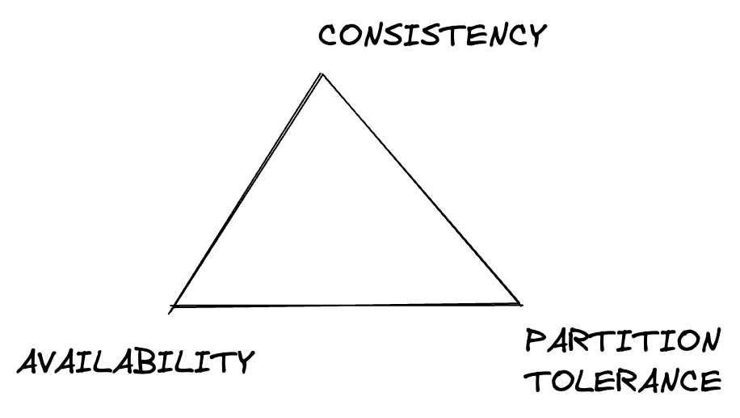

## CAP - Consistency, Availability, Partition Tolerance

Distributed system always have a trade-off between these.

### Consistency
Every Read operation gets the most up to date value.
- Examples where strong consistency needed (Number of items in an inventory, flight prices etc)
- Examples where weak consistency is ok (Number of likes on FB)

### Availability
System must always give a non-error response

### Partition Tolerance
The system should continue to operate despite network partitions.
