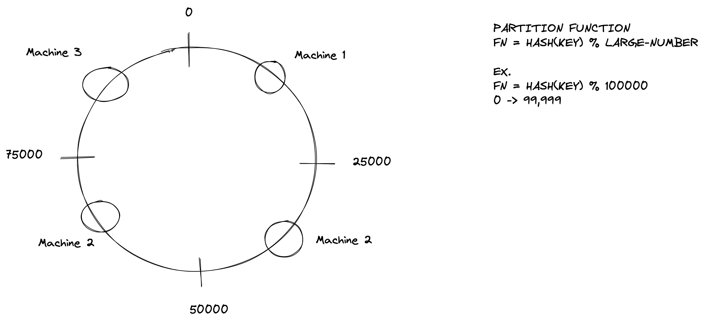

## Consistent Hashing

The machine is assigned by moving clockwise from the calculated hash value.

### Advantages
1. Easier to remap data since data only needs to be moved around from neighboring clusters.