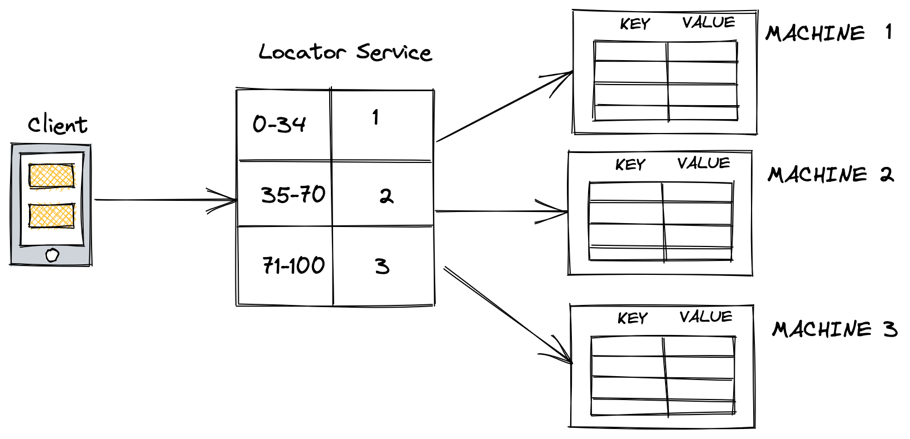

## Dynamic Sharding

Use a separate locator service which maintains the mapping between shards and the machines

### Advantages
1. More control of the data since it is easier to remap the data.

### Disadvantages
1. The locator service can be a single point of failure. To mitigate this we can have a backup location service which is also kept up-to date using synchronous replication.
2. If you have already moved to the secondary locator service and there are no more backups left, then restrict to read-only request for the time being. If that is not feasible, then have more than one backup of the locator service.

### Other Considerations
It can be beneficial to shard the data depending on its nature. For example, if storing a graph, then nodes belonging to the same connected component must be in the same shard. This will minimize cross cluster calls
