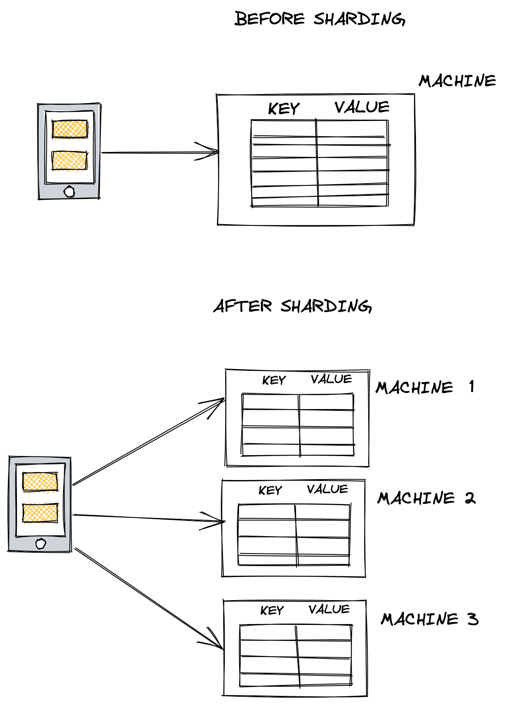

## Sharding - Using Partition Functions

Consider a single-machine that stores key-value pairs and the machine has run out of memory.

1. If we don't expect the data to grow to much, then just add more memory. (vertical scaling)
2. If a lot of read requests are overloading the machine, then create a replica machine and route some of the read traffic to that machine.

**If the machine runs out of memory and we expect the data to grow significantly, we can shard the database (Horizontal scaling)
**

Sharding is the process of breaking the database into chunks and storing them in different machines.

**Partition Function for Key-Value pairs** = hash(key) % num_machines

The request from client is passed through the partition function to identify the machine which stores the key.

### Advantages
1. Simplicity - Not much overhead on the client

### Disadvantages
1. It may not be possible to evenly distribute the data across all the machines ultimately leading to some machines being the hot-spot
2. The keys will need to be re-assigned per the new partition function when extra machines are added 
3. Database replication will need to be performed again after the key re-mapping process

