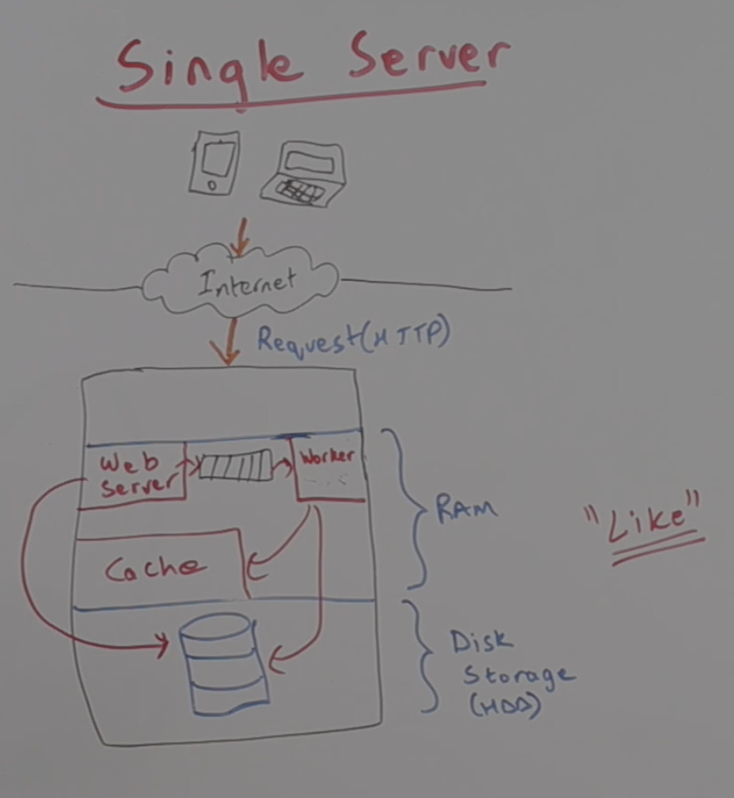
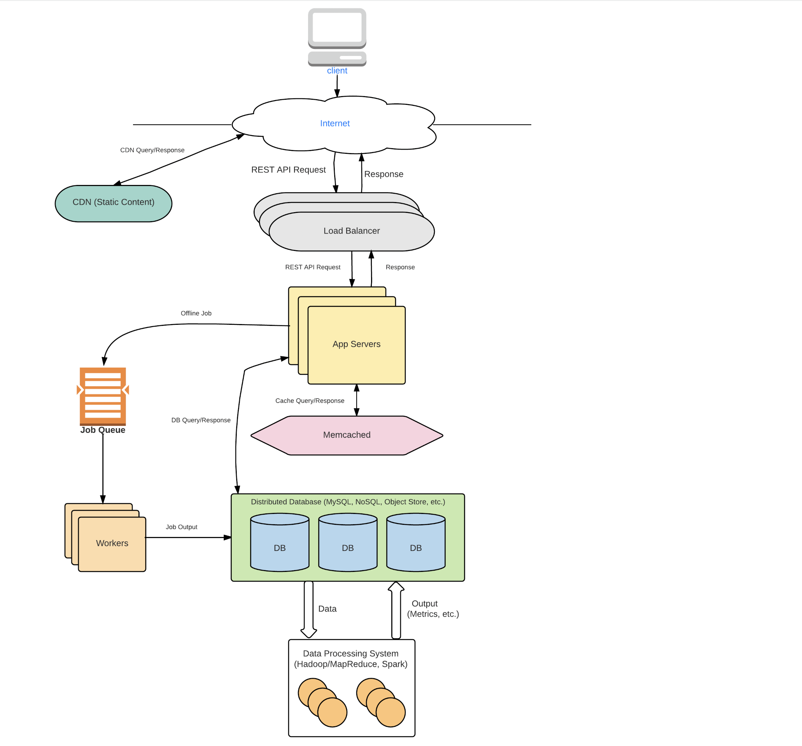

## Anantomy of a scalable Web Application

### Single Server

### Techniques to Scale
* vertical Scaling 
  * Still use a single server but add more processing power, more RAM, more disk space etc. 
  * Eventually becomes expensive and impractical.

* Horizontal scaling
  * Use multiple servers
  * Coordination of servers can be a bottleneck.

### Distributed System Design

1. Client send request via internet
2. Load balancer is responsible for routing the request
3. The app server can process the request an can update the cache/Database
4. Alternatively, for long running task (such as 4K video upload) an asynchronous task is created in the job queue. 
5. The workers poll a task from the queue. Process the task and update the cache/Database
6. The data processing system can be used for analytics