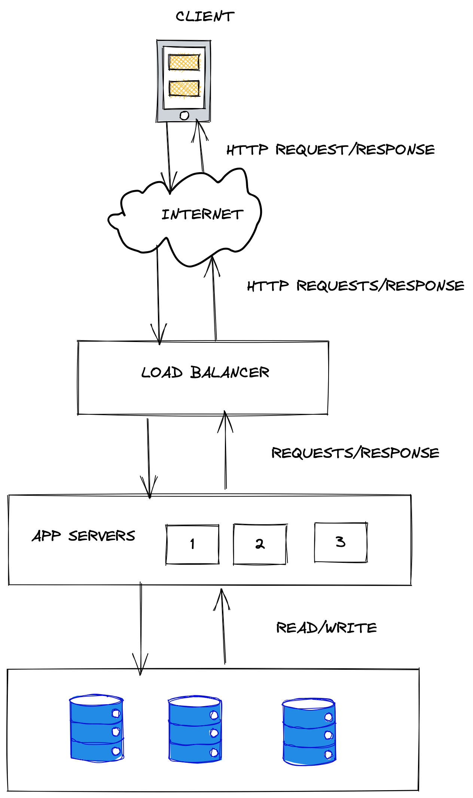

## Load Balancers

### Points to Note:
1. Can be dedicated hardware or software (mostly software these like nginx)
2. Accept request from client
3. Pick an app server
4. Forward request to app server
5. Receive response from app server
6. Relay response back to client

### Advantages
1. Improves response time by picking the most available app server.
2. Improve Fault tolerance as it can be alerted when an app server is down.
3. Hides internal servers thus improving security.
4. Can be configured to handle failures gracefully.

Note about fault tolerance - LB can be a single point of failure. To mitigate this there are HA (high availability pairs)

### Assumptions about our system
1. All requests are HTTP requests via REST API
2. App servers do not maintain any state. All state is maintain is the distributed database or on the client side.
3. All requests are processed in a short amount of time (No long connections)

### Scheduling Algorithms
1. Round Robin - 1 > 2 > 3 > 1 > 2 > 3
2. Weighted Round Robin - Takes the server power into account. 2x the power, 2x the requests. 
3. More sophisticated approach
   * Periodically ping servers to capture server load, response time, up/down state
   * Also take the geo-location of the server into account.
   * Capabilities
   * Number of connections to the app server are also taken into account incase of long connections (upload/download service)

### Stateless App Servers

#### Advantages
1. Easy to scale
2. Can be more fault tolerant

#### Disadvantages
1. Roundtrip time to the storage layer
2. Eventual consistency (multiple people booking flights)
3. Misc case - multiplayer games both players need to be connected to the same server

### Load Balancer Persistence
1. App server maintain state.
2. Requests from the same user need to be routed to the same app server
   * Look at the IP address from which the request originated and always route to the same server (Layer 4 LB. Transport Layer in the OSI model). May not always work if the user opens the session at a different location
   * Cookies - when a session is started the app server issues a session ID so that requests are routed appropriately (layer 7 LB. Application layer in the OSI model)